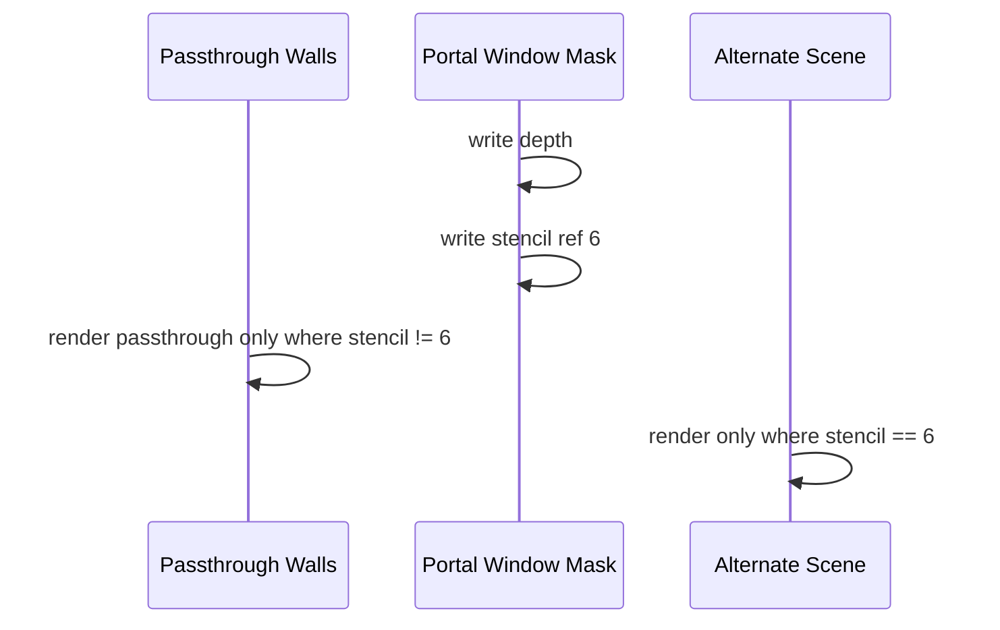

# Render Pipeline and Stencil

## Why This Needs Special Documentation

This project originally used URP `RenderObjects` features to implement Portal Window rendering.

That approach worked partially in editor and over Link, but on the real Meta Quest 3 device it caused:

- periodic render-loop spikes
- frame drops
- visual instability that looked like drifting or head-locked reprojection artifacts
- worse behavior specifically for content routed through those custom passes

The current implementation is the result of moving that logic back into normal URP rendering with carefully chosen materials and layers.

For term definitions, see [Glossary](glossary.md).

## Previous Problematic Design

The old mobile path relied on custom `RenderObjects` features in `Mobile_Renderer.asset`.

The failure mode was:

- the stencil path redrew content in extra render passes
- those passes were expensive on Quest
- XR stability degraded when frametimes spiked
- objects in the custom render path appeared to drift while objects outside it stayed stable

The biggest practical lesson is:

> On this project, custom `RenderObjects` portal rendering was not reliable enough on Quest and should not be reintroduced casually.

## Current Mobile Renderer State

`Assets/Settings/Mobile_Renderer.asset` currently uses:

- no active renderer features
- normal opaque rendering for `portalMask` and `portalContent`
- normal transparent rendering for Passthrough Walls
- `m_UseNativeRenderPass: 0`

This is intentional.

## Current Shader Roles

### 1. `StencilMask.shader`

File:

- `Assets/Materials/Shaders/StencilMask.shader`

Role:

- invisible Portal Window writer
- writes `Stencil Ref`
- writes depth
- does not output color

Important settings:

- `ColorMask 0`
- `ZWrite On`
- `ZTest LEqual`
- `Stencil Pass Replace`

This shader is used by Portal Window mask objects.

### 2. `PortalContentUnlit.shader`

File:

- `Assets/Materials/Shaders/PortalContentUnlit.shader`

Role:

- renders the Alternate Scene visible through the Portal Window

Important settings:

- `Stencil Ref 6`
- `Comp Equal`
- two passes:
  - **Pass 1 - depth prime** (`LightMode SRPDefaultUnlit`, `ColorMask 0`, `ZWrite On`, `ZTest Always`)
  - **Pass 2 - colour** (`LightMode UniversalForward`, `ZWrite On`, `ZTest LEqual`)

Why two passes:

- The Alternate Scene must render "over" the regular scene / passthrough / portal box (it is a window
  into another reality), so it must **not** be clipped by the outside depth buffer.
- A single `ZTest Always` pass achieves that but disables **self**-occlusion inside the content mesh:
  triangles overwrite each other in submission order, so the mesh looks frayed and faces drop out
  depending on the view angle (e.g. the top of a box disappearing).
- Pass 1 redraws the mesh depth-only with `ZTest Always`, overwriting whatever depth was in the
  portal region (the box front face from `StencilMask`, or scene geometry in front) with the
  content's **own** depth. Pass 2 then draws colour with `ZTest LEqual` against that primed depth, so
  only the nearest content triangle per pixel survives. Result: the "over everything" look is kept,
  but the mesh occludes itself correctly.
- URP draws `SRPDefaultUnlit` passes before `UniversalForward` passes, which guarantees pass 1 runs
  before pass 2.

### 3. `SelectivePassthroughStencil.shader`

File:

- `Assets/Materials/Shaders/SelectivePassthroughStencil.shader`

Role:

- Passthrough Wall rendering based on the Oculus selective passthrough approach
- respects the Portal Window opening by skipping pixels where portal stencil is present

Important settings:

- `Stencil Ref 6`
- `Comp NotEqual`
- `Blend Zero SrcAlpha`

## Current Layer Responsibilities

| Layer | Name | Rendering meaning |
|---|---|---|
| 7 | `passthroughWalls` | wall geometry showing real-world passthrough |
| 9 | `portalMask` | invisible window geometry writing depth + stencil |
| 10 | `portalContent` | Alternate Scene content visible through portals |

`content` is now considered legacy and should not be used for new renderer logic.

## Portal Window Rendering Order

The current behavior can be understood in this order:

## Why the Current Design Is More Stable

The current design avoids:

- redraw of large geometry via renderer features
- additional XR-sensitive `RenderObjects` passes
- dependency on custom render-pass ordering for essential scene visibility

Instead it relies on:

- ordinary renderer submission
- layer-based culling
- lightweight unlit shaders
- simple stencil comparisons at material level

## Important Warning for Future Changes

If someone reintroduces `RenderObjects` for portal rendering, they should expect to validate all of the following again on device:

- frametime stability
- stereo correctness in both eyes
- passthrough interaction
- Portal Window masking correctness
- drift/reprojection artifacts under load

Any future attempt to restore custom renderer features should be treated as an explicit experiment and documented with profiler captures.
